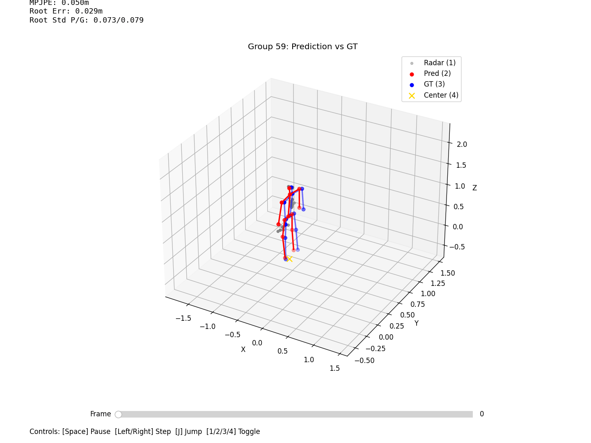

# GeoSTAR-Pose: Radar-Only 3D Human Pose Estimation

GeoSTAR-Pose is a radar-only 3D human pose estimation project for sparse mmWave point clouds. The model uses geometry-guided spatio-temporal attention with radar anchors to regress a 13-joint 3D skeleton from radar sequences.

The repository contains the training, inference, visualization, real-time demo, and public benchmark adapter code. Raw data, processed tensors, prediction outputs, and model weights are not committed to the repository.

#Demo_Video

https://github.com/user-attachments/assets/e109d8f6-f6d2-4433-a3ad-7da1c87f54b6

## Visualization

Use the interactive viewer after running inference:

```powershell
python vis.py --data_root Data_With_Pred\GeoSTAR_fulldata_40
```

Selected examples are kept in `animations/` for quick inspection.



## Highlights

- Radar-only input for 3D human pose regression.
- GeoSTAR model branch with anchor tokens and spatio-temporal Transformer mixing.
- Offline pipeline for radar/IMU alignment, dataset packing, training, inference, and visualization.
- Real-time inference UI and radar processing modules under `realtime/`.
- Public benchmark adapters under `benchmarks/`.

## Repository Structure

```text
.
├── model.py                         # GeoSTAR and baseline model definitions
├── train_net.py                     # Training entry point
├── inference.py                     # Batch inference and metric export
├── data_align.py                    # Radar/IMU coordinate alignment
├── process_data.py                  # Dataset window packing
├── vis.py                           # Interactive prediction viewer
├── visualize_save_animation.py      # Viewer with animation export
├── viz_check_data.py                # Alignment inspection tool
├── benchmarks/                      # Public benchmark adapters and metrics
├── realtime/                        # Real-time inference and UI modules
├── model/                           # Lightweight experiment logs/configs/curves only
└── animations/                      # Selected demo GIFs
```

Local-only directories are ignored by Git:

- `Data_Collection/`
- `Data_Matched/`
- `Data_Aligned/`
- `Dataset_Ready*/`
- `Data_With_Pred/`
- `.benchmark/`
- `*.pth`, `*.pt`, `*.npy`, `*.mat`, and video files

## Environment

The project was developed with Python and PyTorch. Install dependencies with:

```powershell
pip install -r requirements.txt
```

The real-time UI has a separate dependency file:

```powershell
pip install -r realtime\requirements.txt
```

## Data Pipeline

The local training pipeline expects matched radar and supervision data in `Data_Matched/`, then produces aligned data and packed training tensors:

```powershell
python data_align.py --groups 54-108,131-149,158-204,212-222,224-226
python process_data.py --radar_channels xyzvsnr --seq_len 10 --groups 54-108,131-149,158-204,212-222,224-226 --exclude_groups 5-44,111-126,210-211,223
```

`Data_Matched/`, `Data_Aligned/`, and `Dataset_Ready/` are not included because they contain local/private data and generated tensors.

## Training

The main model type is `GeoSTAR`:

```powershell
python train_net.py --model_type GeoSTAR --save_dir model\Training_Results_GeoSTAR_fulldata --epochs 20
```

Model branches:

- `baseline`: PointNet + temporal Transformer.
- `edgeconv_anchor`: EdgeConv point features + anchor tokens.
- `mmchain_lite`: historical chained temporal attention baseline.
- `GeoSTAR`: geometry-guided spatio-temporal attention with radar anchors.

## Inference

Batch inference reads a trained checkpoint and writes predictions under `Data_With_Pred/`:

```powershell
python inference.py --model_path model\Training_Results_GeoSTAR_fulldata\best_model.pth --output_dir Data_With_Pred\GeoSTAR_fulldata
```

`best_model.pth` is intentionally excluded from Git. If a pretrained checkpoint is needed for reproduction or demo, publish it through GitHub Releases and place it in the matching `model\Training_Results_*` directory after download.

## Current Results

Full-data GeoSTAR, 20 epochs:

```text
test_local_mpjpe    ~= 0.1052 m
root_relative_mpjpe ~= 0.0840 m
foot_motion_ratio   ~= 1.108
```

Full-data GeoSTAR, 40 epochs:

```text
best_epoch          = 31
test_local_mpjpe    ~= 0.1052 m
root_relative_mpjpe ~= 0.0839 m
foot_motion_ratio   ~= 1.123
```

Training error continues to decrease after 20 epochs, while test MPJPE is mostly plateaued. Current next steps focus on stronger geometry modeling, temporal smoothness, and more standardized public benchmark evaluation.

## Public Benchmark Code

The `benchmarks/` package contains adapters and metrics for evaluating the project model on public radar pose datasets. Dataset files are not included in this repository.

Example:

```powershell
python benchmarks\evaluate_mmfi_current_model.py --model_path model\Training_Results_GeoSTAR_fulldata_40\best_model.pth
```

## Real-Time Demo

The `realtime/` directory contains the real-time model loader, radar pipeline, filtering logic, worker thread, and UI code. Large local demo videos and `.pth` weights are ignored by Git.

```powershell
python realtime\ui.py
```

## Artifact Policy

This GitHub repository is intended to stay lightweight and reviewable:

- Code, configs, logs, and selected loss curves are committed.
- Raw data, processed datasets, prediction outputs, weights, and videos are excluded.
- Large checkpoints should be uploaded as GitHub Release assets instead of normal Git files.
